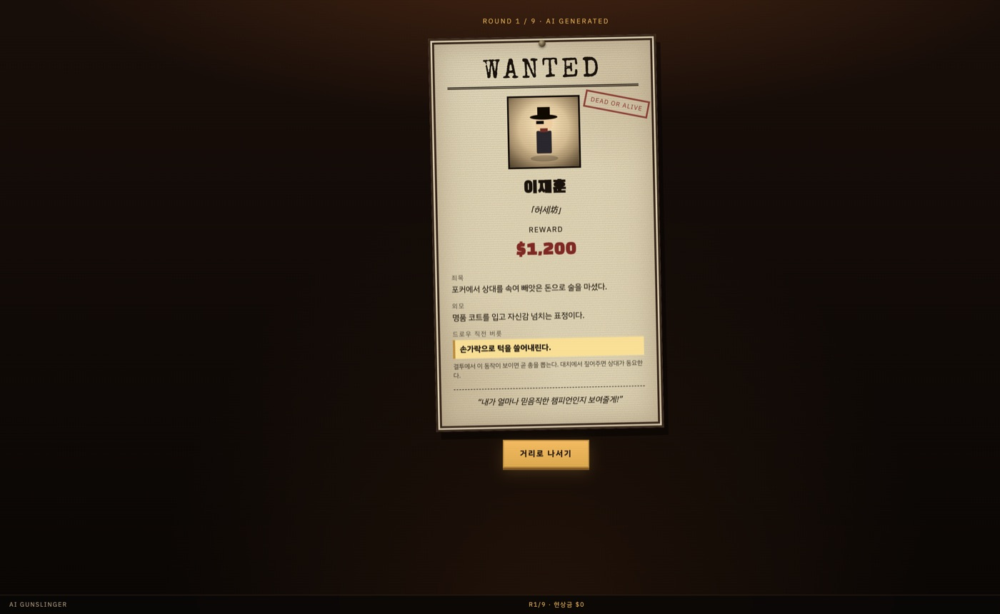
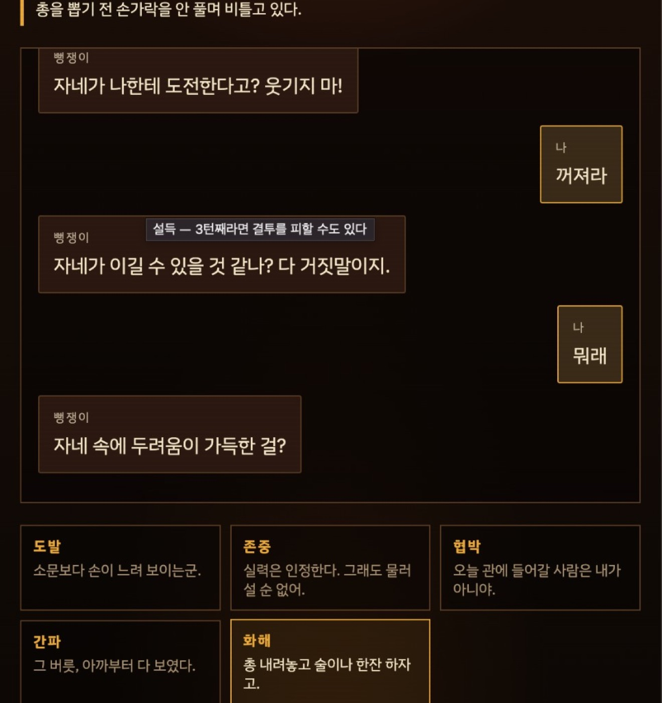
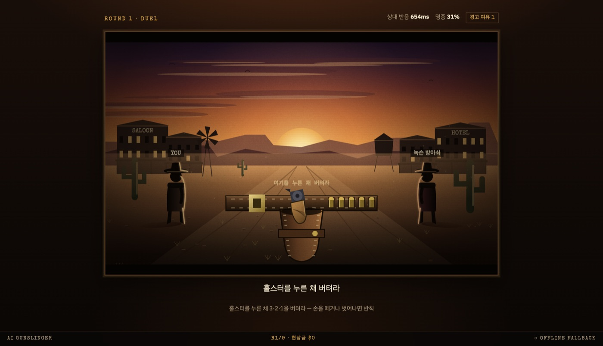
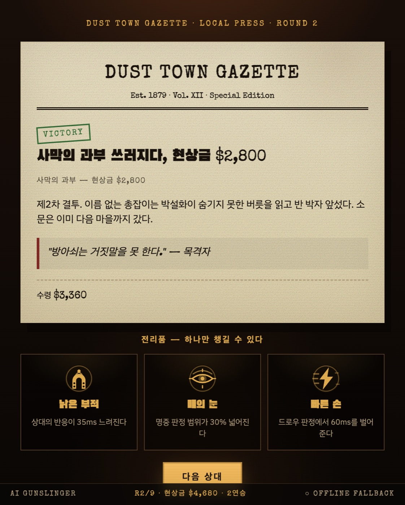
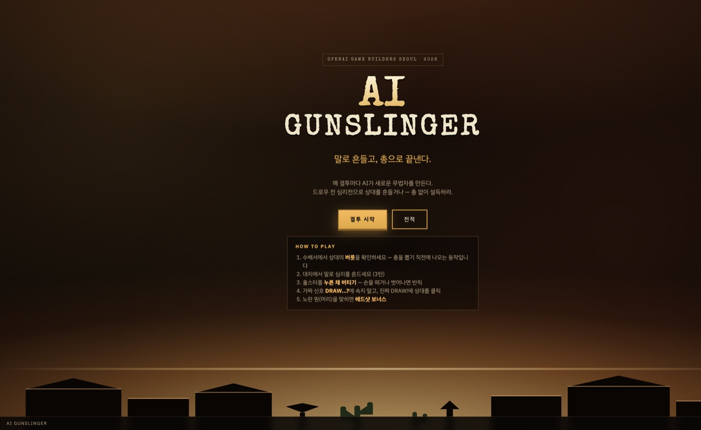

# AI Gunslinger

> **말로 흔들고, 총으로 끝낸다.**

**[▶ 플레이하기](https://ai-gunslinger.vercel.app)** · OpenAI Game Builders Seoul

Gunblood식 서부 결투에 실시간 LLM 심리전을 더한 브라우저 게임입니다.  
매 라운드 AI가 새로운 무법자를 만들고, 대치에서의 대화가 상대의 **반응속도·명중률**을 바꿉니다. 설득에 성공하면 총을 쏘지 않고 끝낼 수도 있습니다.

**핵심 설계:** 결투 판정은 순수 클라이언트(지연 0). AI는 결투 **전·후** — 수배서, 대치, 신문 — 에만 개입합니다.

---

## 시연 화면

한 판의 핵심 흐름을 네 화면으로 요약했습니다.

| 1. 수배서 | 2. 대치 |
|:---:|:---:|
|  |  |
| AI가 이름·죄목·**버릇**을 생성 | 3턴 대화 → mood → 결투 수치 |

| 3. DRAW! | 4. 신문 |
|:---:|:---:|
|  |  |
| 홀스터 홀드 → 가짜 신호 무시 → 클릭 | 결과 기사 + (승리 시) perk |



---

## 말로 흔들면, 총이 달라진다

대치에서 선택한 말은 곧바로 결투 난이도로 이어집니다.

```
플레이어 대사
    ↓  POST /api/chat
LLM이 mood 판정  (평정 / 분노 / 위축 / 공포 / 경계)
    ↓  서버가 mood 구간으로 수치 클램프
reactionDeltaMs  +  accuracyDelta
    ↓  결투 시작 시 합산
상대 드로우 속도  =  baseReactionMs + Σ reactionDeltaMs
상대 명중률      =  baseAccuracy   + Σ accuracyDelta
```

| 전술 | 상대 mood | 드로우 | 명중 | 플레이어 입장 |
|------|-----------|--------|------|---------------|
| 무심한 대화 | 평정 `calm` | 빨라짐 | 올라감 | 불리 |
| 도발 | 분노 `angered` | 더 빨라짐 | 크게 흔들림 | 트레이드오프 |
| 존중 | 위축 `intimidated` | 느려짐 | 약간 하락 | 유리 |
| 협박 | 공포 `scared` | 크게 느려짐 | 흔들림 | 크게 유리 |
| 버릇 간파 | 경계 `suspicious` | 느려짐 | 하락 | 유리 |
| 화해 (3턴째) | 설득 mood | — | — | **평화 엔딩** 가능 |

수배서의 **버릇**은 두 갈래 단서입니다. 대치에서 짚으면 상대가 동요하고, DRAW! 직전 같은 동작이 보이면 곧 총을 뽑습니다.

평화 엔딩은 `peaceAllowed(round, turn, mood)`로 서버가 검증합니다. 마지막 턴에서 설득에 맞는 mood일 때만 통과하며, 라운드가 진행될수록 조건이 까다로워집니다.

---

## 플레이 흐름

1. **수배서** — AI가 무법자 JSON 생성 (이름, 별명, 죄목, 버릇, 성격, 난이도)
2. **대치 3턴** — 도발 / 존중 / 협박 / 간파 / 화해 또는 직접 입력. 대화가 결투 수치를 바꿉니다
3. **DRAW!** — 홀스터를 누른 채 대기 → `DRAW…?` 무시 → 진짜 `DRAW!`에 상대 클릭. 노란 원(머리)은 헤드샷
4. **신문** — 승리·패배·평화 기사 + 승리 시 perk 1개
5. 9라운드 완주 또는 패배 → 엔딩. 전적은 `localStorage` (`ai-gunslinger.records.v1`)

API 키가 없어도 폴백 덱으로 전체 루프를 플레이할 수 있습니다. 푸터에 `LIVE AI` / `OFFLINE FALLBACK` 상태가 표시됩니다.

---

## Codex 활용

OpenAI Codex(코딩 에이전트)를 구현 엔진으로 사용하고, 인간 팀은 설계·가드레일·플레이 감각을 담당했습니다.

**Codex가 구현한 영역**

- React 19 + Vite 스캐폴드, 9라운드 상태 머신, 수배서 / 대치 / DRAW / 신문 / 엔딩 화면
- Vercel Serverless 3종 — `POST /api/generate` · `/api/chat` · `/api/newspaper`
- 공유 컨트랙트 `api/_lib/rules.ts` — 한국어·세계관·페르소나 락, mood 클램프, 평화 게이트, sanitize, 레이트리밋
- API 실패 시 `src/data/fallback.ts`로 끊기지 않는 오프라인 엔진
- Canvas 결투장, perk, 전적 보드, 배포 설정

**인간이 직접 설계·검증한 영역**

- **AI 개입 타이밍** — LLM 지연이 DRAW 판정을 흔들지 않도록, 결투는 클라이언트에서만 처리
- **대화 → 수치 변환 규칙** — mood별 `reactionDeltaMs` / `accuracyDelta` 허용 구간을 설계하고, 모델 출력은 서버가 교정
- **프롬프트를 계약으로 관리** — JSON 스키마, 용어 통일(텔 → 버릇), 인젝션 방어를 코드로 강제
- **폴백 우선 설계** — API 키 없이도 데모·제출 링크에서 전체 플로우가 동작하도록 구성

---

## 인간 팀 (2명)

에이전트가 코드를 작성하는 동안, 두 사람은 **게임이 왜 재미있어야 하는지**에 집중했습니다.

**게임 디자인 / 디렉션**

- 한 줄 컨셉: *말로 흔들고, 총으로 끝낸다*
- Gunblood식 결투 루프를 유지하면서, 심리전을 DRAW **직전**에 배치
- 9라운드 아키타입(초반 → 최종 보스), 평화 엔딩 조건, perk 경제
- 화면 흐름, 카피, 시연 동선 정리

**시스템 / 플레이 감각 / 가드레일**

- 홀스터 홀드, 가짜 `DRAW…?`, 헤드샷, 경고 여유 — 반응속도 게임의 리스크와 보상
- mood 표와 난이도 커브(`baseReactionMs` / `baseAccuracy` / 현상금) 밸런스
- 한국어 입말, 세계관(더스트 타운), 버릇이 공략 단서가 되도록 카피 검수
- AI 대사의 맥락 단절·도발 반복 등을 플레이테스트로 확인하고 프롬프트·폴백 개선
- Vercel 배포, 환경변수, 라이브/폴백 표시 — 제출 링크 즉시 플레이 가능하도록 구성

**역할 분담:** 사람은 규칙을 정하고, Codex는 규칙을 코드로 옮깁니다.

---

## 조작

- 홀스터를 **누른 채** 대기합니다. 손을 떼거나 범위를 벗어나면 반칙입니다
- 가짜 신호 `DRAW…?`는 무시하고, 진짜 `DRAW!`에 상대를 클릭합니다
- 수배서의 **버릇**을 대치에서 짚으면 상대가 동요합니다
- 노란 원(머리)을 맞히면 헤드샷 보너스가 적용됩니다

---

## 로컬 실행

```bash
cp .env.example .env.local
# .env.local 에 OPENAI_API_KEY 입력 (서버 전용 — 커밋 금지)

npm install
npm run dev          # 프론트만 (폴백 모드) → http://localhost:5173
npm run dev:full     # vercel dev — /api/* 포함 → http://localhost:3000
```

| 변수 | 필수 | 설명 |
|------|------|------|
| `OPENAI_API_KEY` | AI 사용 시 | OpenAI 키. Vercel / `vercel dev`에서만 읽음 |
| `OPENAI_MODEL` | 선택 | 기본 `gpt-4.1-nano` (빠르고 저렴) |

프론트 번들에는 API 키를 포함하지 않습니다. `.env*` 파일은 gitignore 대상입니다.

---

## AI 엔드포인트

| 경로 | 역할 |
|------|------|
| `POST /api/generate` | 라운드별 무법자 JSON |
| `POST /api/chat` | 대치 대사 + mood → `reactionDeltaMs` / `accuracyDelta` / 평화 |
| `POST /api/newspaper` | 승리·패배·평화 기사 |
| `GET /api/health` | 키 존재 여부. 푸터 `LIVE AI` 표시용 |

가드레일은 `api/_lib/rules.ts`에 모았습니다. OUTPUT / KOREAN / DIALOGUE / WORLD / PERSONA 규칙을 적용하며, 모델이 숫자를 벗어나도 서버가 mood 구간으로 되돌립니다.

---

## 스택

React 19 · TypeScript · Vite · Vercel Serverless · OpenAI Chat Completions (`gpt-4.1-nano`)
